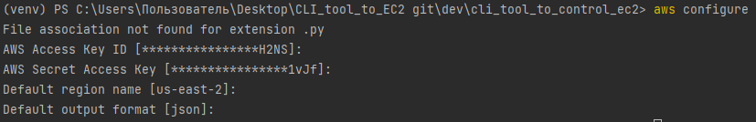
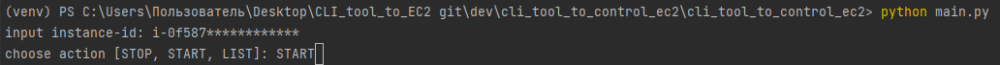

# EC2 Control CLI Tool

This is a command-line interface tool built in Python to control Amazon Elastic Compute Cloud (EC2) instances. It provides various commands to start, stop, and list EC2 instances. It uses the boto3 library to interact with the AWS API.## Installation
### Getting Started:
1. Clone this repository using the following command:
```bash
git clone https://github.com/MontyPython-ManuL/CLI_tool_to_control_EC2.git
```

2. Navigate to the project directory:
```bash
cd cli_tool_to_control_ec2
```
3. Configure the AWS credentials using aws configure or by setting the environment variables `AWS_ACCESS_KEY_ID`, `AWS_SECRET_ACCESS_KEY`, `region` and `instance-id`:

4. Run the tool using the following command
```
python main.py
```
## Commands

#### This tool provides the following commands:


Starts an EC2 instance.
```
instance-id: i-***********
choose action [STOP, START, LIST]: START
```

Stops an EC2 instance.
```
instance-id: i-***********
choose action [STOP, START, LIST]: STOP
```

Lists all EC2 instances.
```
instance-id: i-***********
choose action [STOP, START, LIST]: LIST
```

### Contributing
Contributions are welcome! Please open an issue or submit a pull request.

#### Author 

Носаченко Олег – MontyPython-ManuL